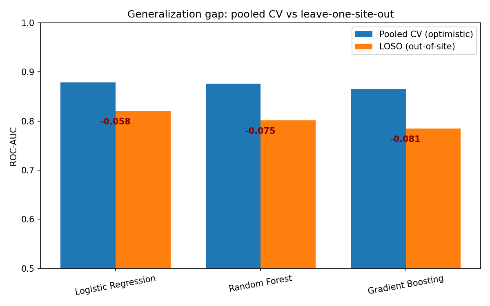
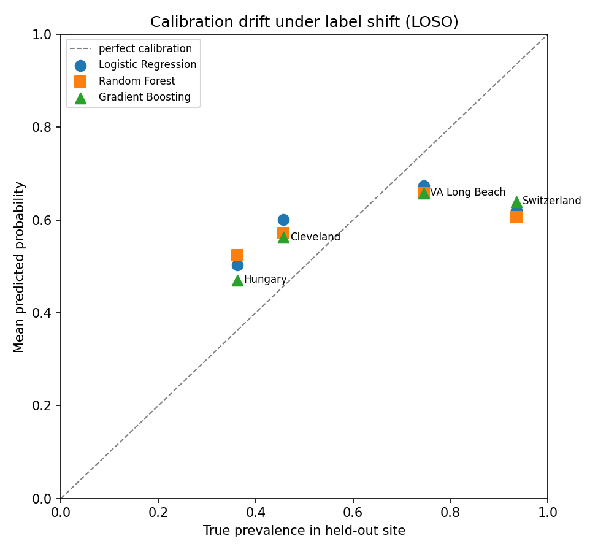

# Does Heart-Disease Prediction Transfer Across Hospitals?

**NOTICE:** This project is meant purely for learning and discovery.

A clinical machine-learning **methodology** study on the UCI Heart Disease
dataset. The dataset is famous and the prediction is easy, so this project does
not try to win on AUC. Instead it asks the questions that decide whether a
clinical model is trustworthy: **does it generalize to a new hospital, are its
probabilities calibrated, is it fair, and can it quantify its own uncertainty?**
Every result is reported with a confidence interval and, where comparative, a
statistical test.

> **[REPORT.md](REPORT.md)** - the full mini-paper | **[reports/FINDINGS.md](reports/FINDINGS.md)** - all numbers with CIs | **[Model Card](MODEL_CARD.md)** | **[Datasheet](DATASHEET.md)**

---

## The headline result

The four hospital cohorts (Cleveland, Hungary, Switzerland, VA Long Beach) differ
in outcome prevalence (36% -> 93%), demographics, and even which features were
recorded. So the standard pooled cross-validation number is optimistic. Holding
out an **entire hospital** (leave-one-site-out) reveals the real transfer:

| Model | Pooled-CV AUC | **LOSO AUC** | Generalization gap |
|---|---:|---:|---:|
| Logistic Regression | 0.879 | **0.821** | -0.058 |
| Random Forest | 0.876 | **0.801** | -0.075 |
| Gradient Boosting | 0.866 | **0.785** | -0.081 |



And probability **calibration collapses** across sites - the model exports its
~50% training prevalence regardless of a hospital's true rate:



## What else the study finds (all in [FINDINGS.md](reports/FINDINGS.md))

- **The models are statistically tied.** Nested-CV AUCs ~0.88; all pairwise
  DeLong tests p > 0.33. Chasing the "best" model is chasing noise.
- **Complexity doesn't pay.** A 7-feature clinical baseline (AUC 0.881) is
  indistinguishable from the full 13-feature model (0.874), DeLong p = 0.68 - and
  both beat treat-all/treat-none on decision-curve net benefit.
- **The model is clinically sensible.** 8/8 key features (ST depression, vessels,
  exercise angina, max heart rate, ...) are learned in the cardiologically correct
  direction (SHAP + signed coefficients).
- **Missingness is a leak, not a signal.** It predicts the *site* at 85.5% but is
  pure chance (AUC 0.50) within a single complete cohort.
- **A fairness gap hides behind equal AUC.** At a 0.5 threshold the model misses
  women's disease 2.4x as often as men's (FNR 0.36 vs 0.15).
- **Honest uncertainty.** Split-conformal prediction hits its target coverage
  (0.91 at 90%) and abstains on ~27% of patients.

## What this demonstrates

External validation | nested cross-validation | bootstrap confidence intervals |
DeLong significance testing | probability calibration & recalibration |
decision-curve analysis | standard-of-care baselining | SHAP interpretability with
clinical cross-checks | informative-missingness leakage analysis | subgroup
fairness auditing | conformal prediction | reproducible pipelines, unit tests, and
CI. The guiding principle throughout is **honest reporting over impressive
numbers**.

## Dataset

UCI Heart Disease (n = 920), aggregated from four hospitals and distributed via
[Kaggle](https://www.kaggle.com/datasets/redwankarimsony/heart-disease-data) /
the [UCI ML Repository](https://archive.ics.uci.edu/ml/datasets/Heart+Disease).
The CSV is committed under `data/raw/` for reproducibility; see the
[Datasheet](DATASHEET.md) for provenance and known artifacts. Citation in
[CITATION.md](CITATION.md).

## Reproducibility

Seed `100` throughout. Every figure and number is traceable via
`reports/run_manifest.json` (git commit + library versions + artifact hashes).

```bash
make setup        # create .venv and install requirements
make download     # fetch the dataset (or use the committed CSV)
make study        # run all analyses + write the provenance manifest
make test         # 27 unit/smoke tests (also run in CI)
```

Individual analyses: `make loso nested calibrate dca interpret missingness fairness conformal`.

## Repository layout

```
src/
  data.py              cohort-aware loader (site as grouping var; chol=0 -> NaN)
  pipeline_utils.py    sklearn pipelines + model builders
  metrics.py  stats.py bootstrap CIs, ECE/Brier, DeLong test
  loso_validation.py   Phase 1 - leave-one-site-out external validation
  nested_cv.py         Phase 2 - nested CV, bootstrap CIs, DeLong
  calibration_analysis.py / decision_curve.py   Phase 3 - calibration + DCA
  interpretability.py  Phase 4 - SHAP + clinical cross-check
  missingness.py       Phase 5 - missingness leakage + imputation sensitivity
  fairness.py          Phase 7 - subgroup audit (sex, age)
  conformal.py         Phase 6 - split-conformal prediction
  manifest.py          reproducibility manifest
tests/                 unit + smoke tests (CI: .github/workflows/ci.yml)
reports/               FINDINGS.md, CSVs, figures, run_manifest.json
REPORT.md MODEL_CARD.md DATASHEET.md
```

> WARNING: Research/education only - not a medical device. See the
> [Model Card](MODEL_CARD.md) for intended use and limitations.
