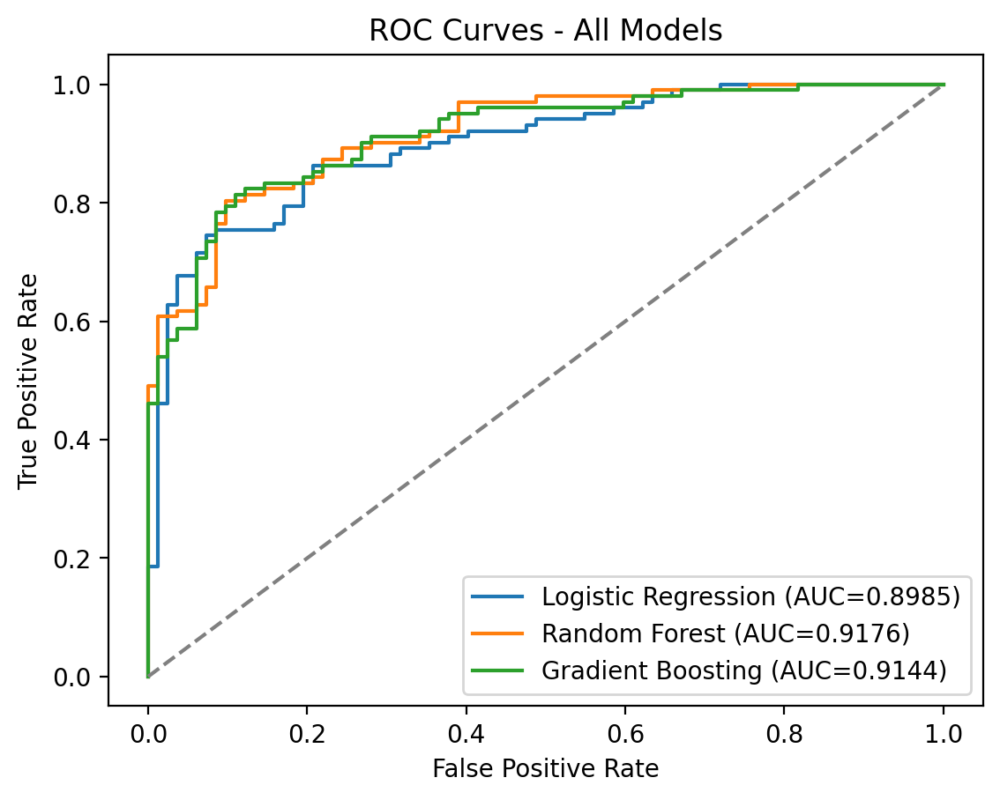
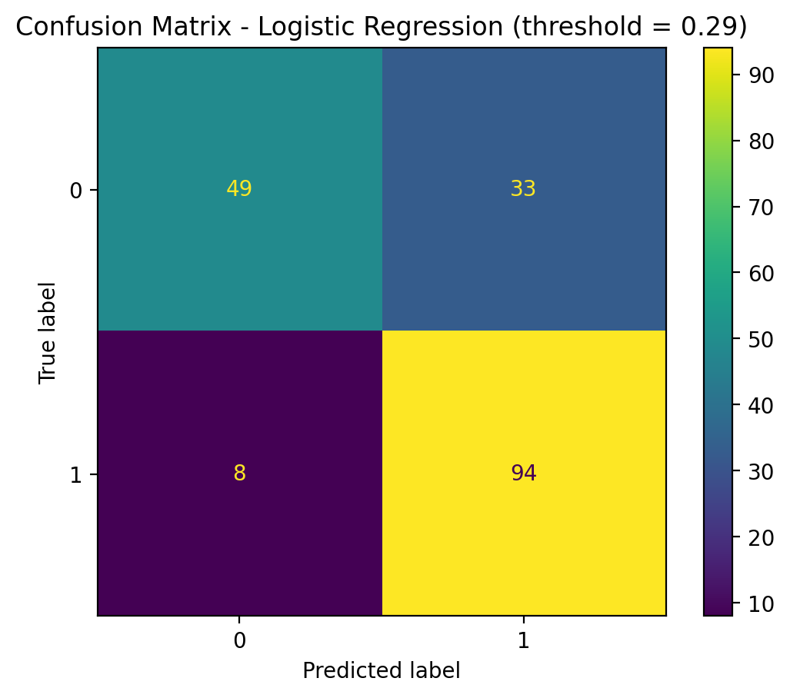
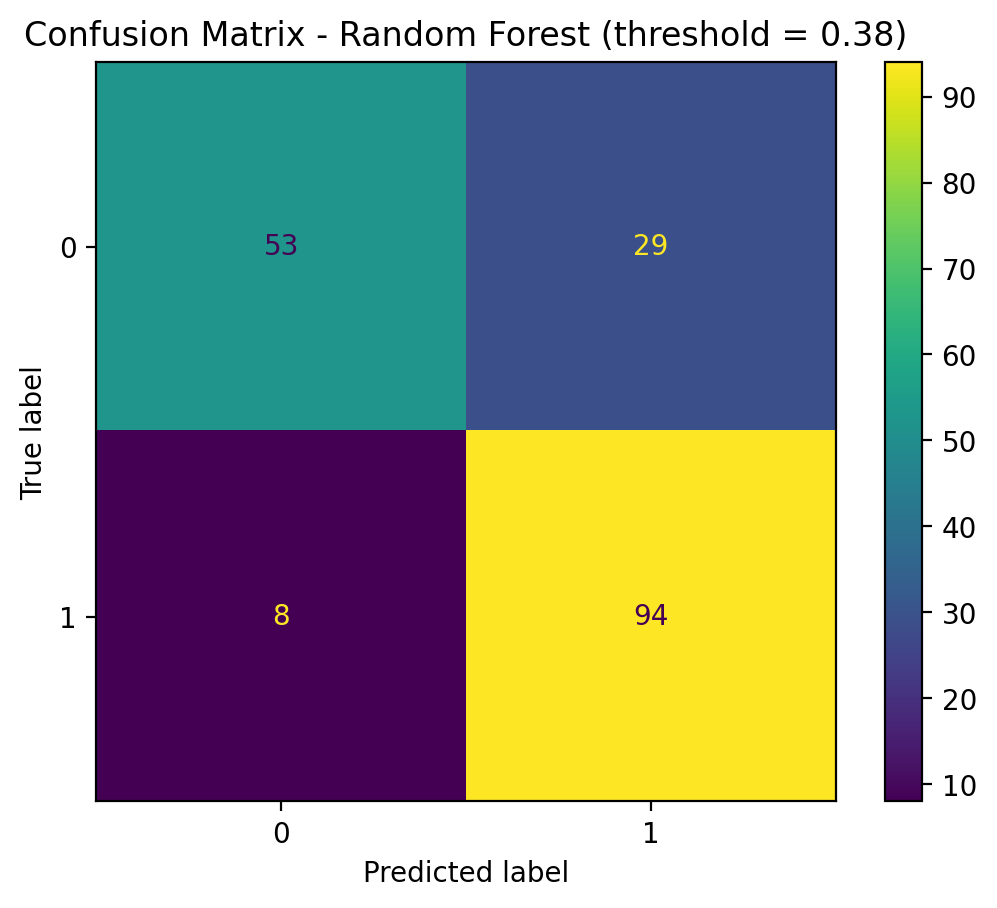
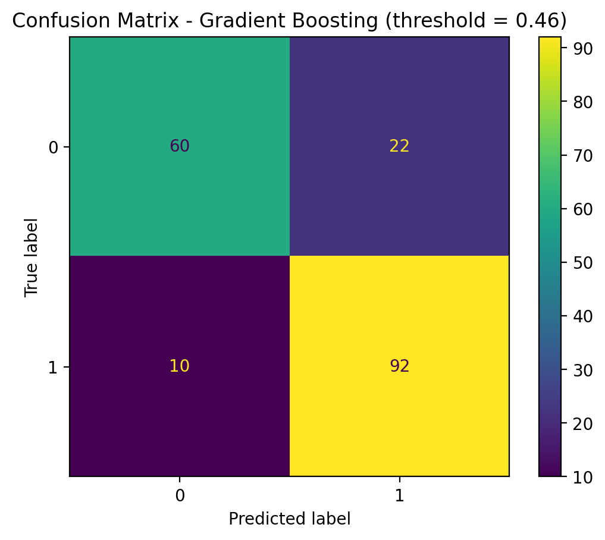
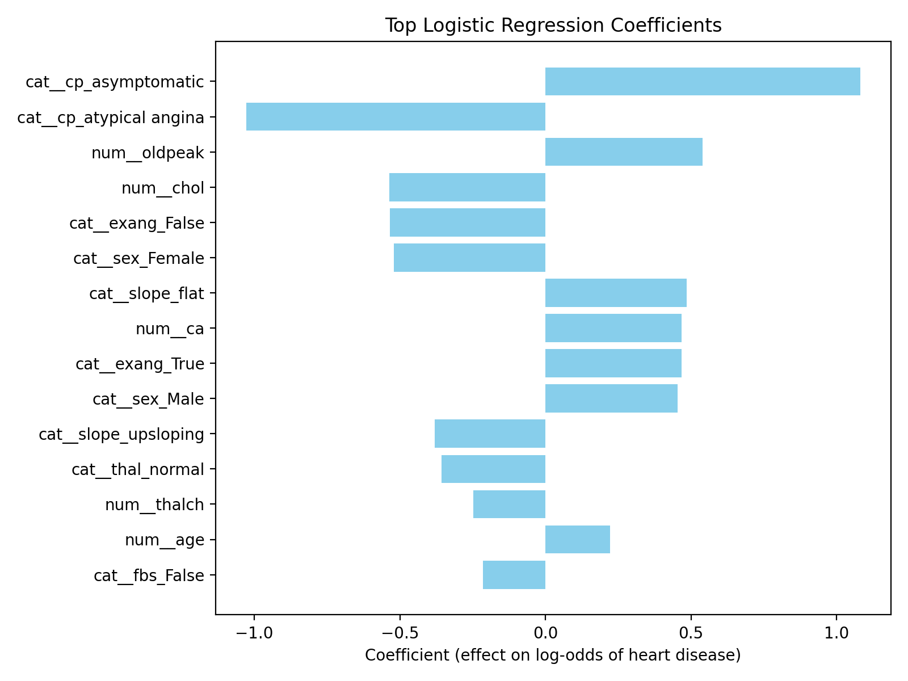

# Heart Disease Classification (Logistic Regression + Random Forest + Gradient Boosting)

**NOTICE:** This project is meant purely for learning and discovery.

A reproducible machine learning pipeline for predicting heart disease from clinical features using logistic regression, random forest, and gradient boosting models.

This project demonstrates an end-to-end ML workflow including preprocessing, cross-validation, model comparison, evaluation, interpretability, and reproducibility practices.

---

## Overview

The goal is to predict whether a patient has heart disease (`num > 0`) using demographic, clinical, and diagnostic features from the UCI Heart Disease dataset.

Each model uses a scikit-learn pipeline combining:

- imputation (missing values)
- scaling (numeric features)
- one-hot encoding (categorical features)
- logistic regression, random forest, or gradient boosting classifier
- hyperparameter tuning (CV search on ROC-AUC)
- threshold tuning on a validation split (optimize F1 instead of fixed 0.5)

---

## Dataset

This project uses the **Heart Disease Dataset** available on Kaggle:

https://www.kaggle.com/datasets/redwankarimsony/heart-disease-data

The dataset aggregates several heart disease cohorts (Cleveland, Hungary, Switzerland, and others) originally published in the UCI Machine Learning Repository:

Dua, D. and Graff, C. (2019). *UCI Machine Learning Repository*. University of California, Irvine, School of Information and Computer Sciences.  
https://archive.ics.uci.edu/ml/datasets/Heart+Disease

The dataset is downloaded programmatically using `kagglehub` and is not stored in this repository.

## Results

After removing dataset-origin features to avoid cohort bias, all three models perform strongly:

- **Logistic Regression**
  - Test ROC-AUC: 0.899
  - Accuracy (tuned threshold): 0.777
  - F1 (tuned threshold): 0.821
  - 5-fold CV ROC-AUC (best search): 0.888
  - Tuned threshold: 0.29
- **Random Forest**
  - Test ROC-AUC: 0.918
  - Accuracy (tuned threshold): 0.799
  - F1 (tuned threshold): 0.836
  - 5-fold CV ROC-AUC (best search): 0.887
  - Tuned threshold: 0.38
- **Gradient Boosting (HistGradientBoostingClassifier)**
  - Test ROC-AUC: 0.914
  - Accuracy (tuned threshold): 0.826
  - F1 (tuned threshold): 0.852
  - 5-fold CV ROC-AUC (best search): 0.881
  - Tuned threshold: 0.46

Model tradeoff summary:

- **Random Forest** gives the best held-out ROC-AUC.
- **Gradient Boosting** gives the best held-out Accuracy and F1.
- **Logistic Regression** remains the most transparent baseline for interpretation.

### Model Comparison Table

| Model | ROC-AUC | Accuracy | Precision | Recall | F1 | Threshold |
|---|---:|---:|---:|---:|---:|---:|
| Random Forest | 0.9176 | 0.7989 | 0.7642 | 0.9216 | 0.8356 | 0.38 |
| Gradient Boosting | 0.9144 | 0.8261 | 0.8070 | 0.9020 | 0.8519 | 0.46 |
| Logistic Regression | 0.8985 | 0.7772 | 0.7402 | 0.9216 | 0.8210 | 0.29 |

### ROC Curves (All Models)


### Confusion Matrices
#### Logistic Regression

#### Random Forest

#### Gradient Boosting


### Feature Importance (Logistic Regression Coefficients)


Key predictors include:

- asymptomatic chest pain
- number of blocked vessels (`ca`)
- ST depression during exercise (`oldpeak`)
- exercise-induced angina
- abnormal perfusion test results
- male sex

These align with established cardiology risk factors.

## What This Demonstrates

- Comparing distinct model families: linear model (logistic regression), bagging (random forest), and boosting (hist gradient boosting).
- Using cross-validated hyperparameter search rather than default settings.
- Tuning decision thresholds for business/clinical objectives (F1) instead of relying on 0.5.
- Evaluating tradeoffs across ROC-AUC, Accuracy, Precision, Recall, and F1.

---

## Reproducibility

The project is fully reproducible using a fixed random seed, stratified splits, and a scikit-learn preprocessing pipeline.

### Quick start

```bash
make setup
make download
make train       # trains logistic regression -> models/logreg.joblib
make train_rf    # trains random forest -> models/rf.joblib
make train_gb    # trains gradient boosting -> models/gb.joblib
make eval
make importance  # logistic regression feature importance
make compare     # writes reports/model_comparison.csv
```

### Main outputs

- `models/logreg.joblib`
- `models/rf.joblib`
- `models/gb.joblib`
- `reports/model_comparison.csv`
- `reports/figures/roc_curve_all_models.png`
- `reports/figures/roc_curve_logreg.png`
- `reports/figures/roc_curve_rf.png`
- `reports/figures/roc_curve_gb.png`
- `reports/figures/confusion_matrix_logreg.png`
- `reports/figures/confusion_matrix_rf.png`
- `reports/figures/confusion_matrix_gb.png`
- `reports/figures/feature_importance.png`
