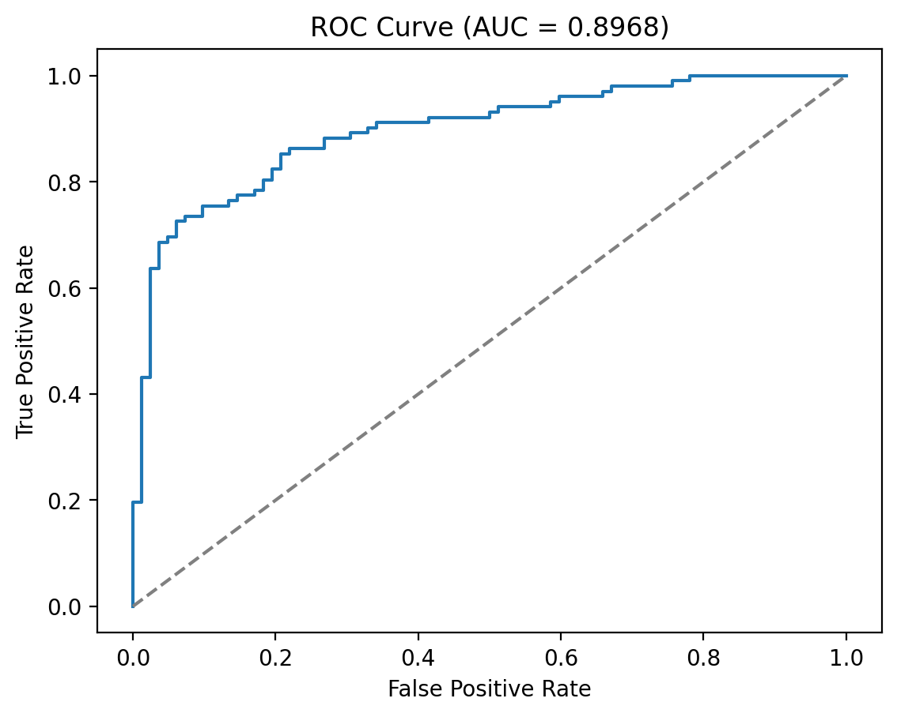
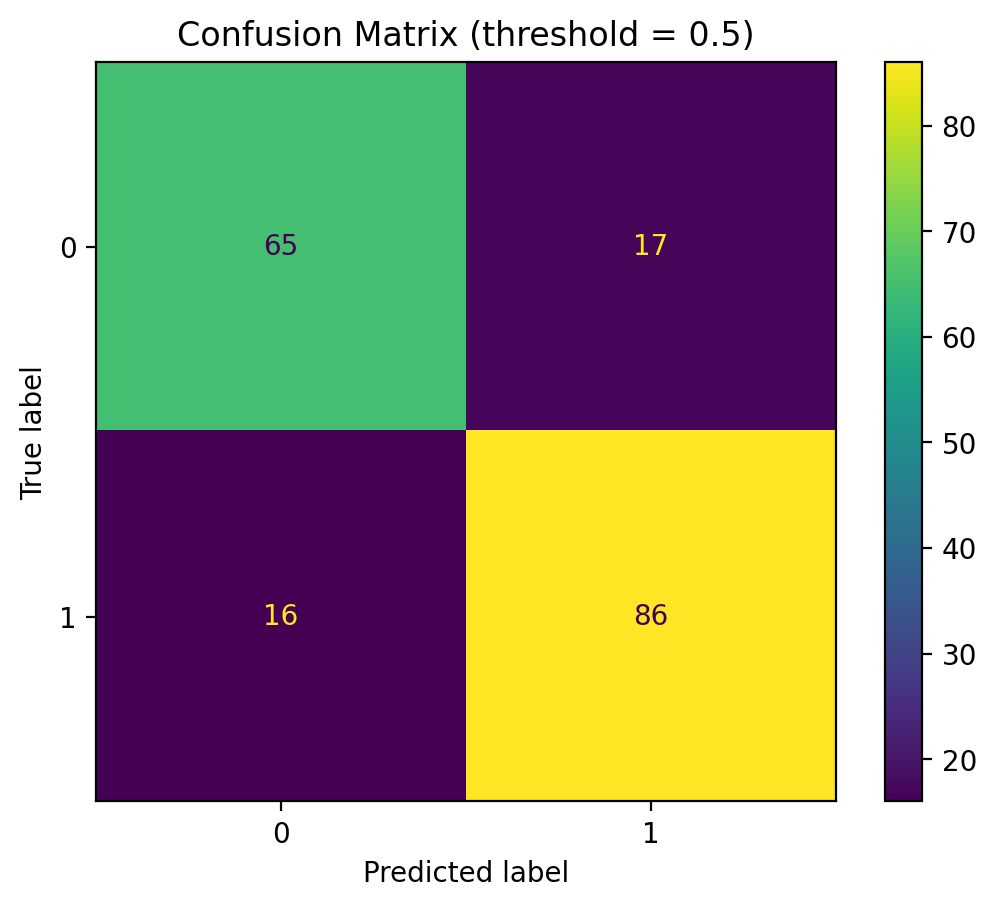

# Heart Disease Classification (Logistic Regression)

A reproducible machine learning pipeline for predicting the presence of heart disease from clinical features using logistic regression.

This project demonstrates end-to-end ML workflow including preprocessing, cross-validation, evaluation, model interpretability, and reproducibility practices.

---

## Overview

The goal is to predict whether a patient has heart disease (`num > 0`) using demographic, clinical, and diagnostic features from the UCI Heart Disease dataset.

The model is a scikit-learn pipeline combining:

- imputation (missing values)
- scaling (numeric features)
- one-hot encoding (categorical features)
- logistic regression classifier

---

## Dataset

This project uses the **Heart Disease Dataset** available on Kaggle:

https://www.kaggle.com/datasets/redwankarimsony/heart-disease-data

The dataset aggregates several heart disease cohorts (Cleveland, Hungary, Switzerland, and others) originally published in the UCI Machine Learning Repository:

Dua, D. and Graff, C. (2019). *UCI Machine Learning Repository*. University of California, Irvine, School of Information and Computer Sciences.  
https://archive.ics.uci.edu/ml/datasets/Heart+Disease

The dataset is downloaded programmatically using `kagglehub` and is not stored in this repository.

## Results

After removing dataset-origin features to avoid cohort bias:

- **Test ROC-AUC:** 0.897  
- **Accuracy:** 0.821  
- **Precision:** 0.835  
- **Recall:** 0.843  
- **5-fold CV ROC-AUC:** 0.882 ± 0.020  

The model retains strong performance using only physiological and clinical variables.

### ROC Curve


### Confusion Matrix


### Feature Importance (Logistic Regression Coefficients)


Key predictors include:

- asymptomatic chest pain
- number of blocked vessels (`ca`)
- ST depression during exercise (`oldpeak`)
- exercise-induced angina
- abnormal perfusion test results
- male sex

These align with established cardiology risk factors.

---

## Reproducibility

The project is fully reproducible using a fixed random seed, stratified splits, and a scikit-learn preprocessing pipeline.

### Quick start (recommended)

```bash
make setup
make download
make train
make eval