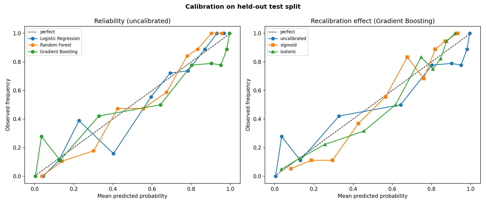
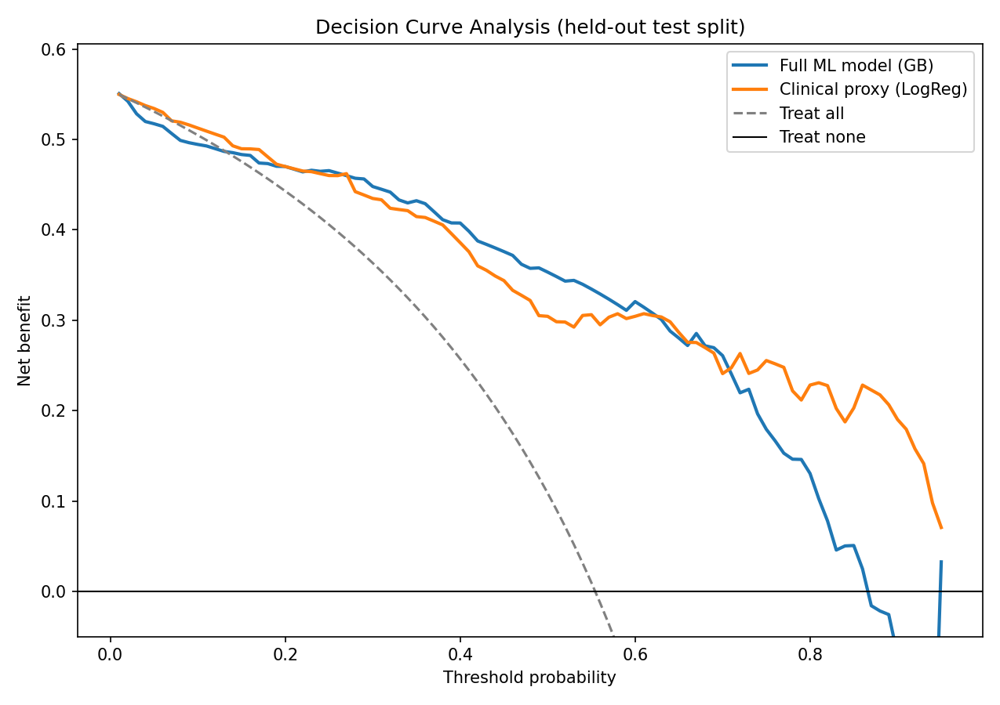
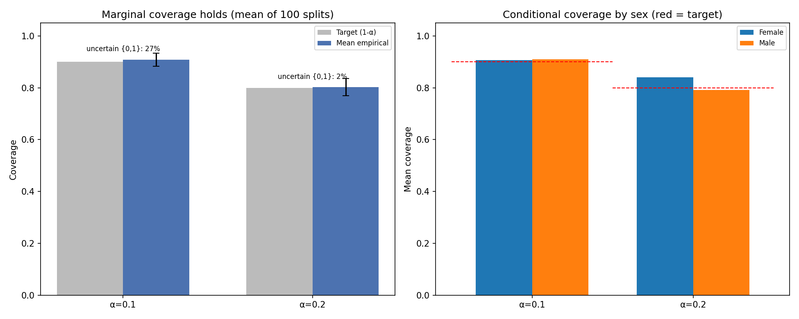
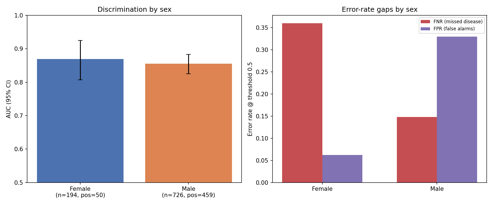

# Does Heart-Disease Prediction Transfer Across Hospitals?

**NOTICE:** This project is meant purely for learning and discovery. It is not a
medical device and must not be used for clinical decisions.

A clinical machine-learning **methodology** study on the UCI Heart Disease
dataset (n = 920, four hospital cohorts). The dataset is famous and the
prediction is easy, so this project does not try to win on AUC. It asks the
questions that decide whether a clinical model is trustworthy: does it transfer
to a hospital it has never seen, are its probabilities calibrated, is it
clinically useful, is it fair, and can it say when it does not know?

Every discrimination number carries a 95% bootstrap confidence interval
(`n_boot = 2000`), and model comparisons carry a DeLong test.

> **[REPORT.md](REPORT.md)** - the full write-up | **[reports/FINDINGS.md](reports/FINDINGS.md)** - every number with CIs | **[Model Card](MODEL_CARD.md)** | **[Datasheet](DATASHEET.md)**

---

## Results

All numbers below are produced by the scripts in [src/](src/) and committed as
CSVs under [reports/](reports/). Three models are evaluated throughout:
logistic regression, random forest, and histogram gradient boosting, each as a
full sklearn pipeline (median/mode impute -> scale -> one-hot -> classifier).

### 1. Leave-one-hospital-out external validation ([loso_results.csv](reports/loso_results.csv))

Each of the four cohorts is held out in turn and predicted by a model trained on
the other three. Pooled random-split CV is the optimistic in-distribution
number; leave-one-site-out (LOSO) is the honest one.

| Model | Pooled-CV AUC | LOSO AUC | Gap |
|---|---:|---:|---:|
| Logistic Regression | 0.879 | **0.821** | -0.058 |
| Random Forest | 0.876 | **0.801** | -0.075 |
| Gradient Boosting | 0.866 | **0.785** | -0.081 |


Per-site held-out performance (gradient boosting) is uneven, and one site is a
genuine failure:

| Held-out site | n | n_pos | Prevalence | AUC [95% CI] | ECE |
|---|---:|---:|---:|---|---:|
| Cleveland | 304 | 139 | 0.457 | 0.811 [0.764, 0.858] | 0.142 |
| Hungary | 293 | 106 | 0.362 | 0.840 [0.793, 0.884] | 0.150 |
| Switzerland | 123 | 115 | 0.935 | 0.795 [0.612, 0.959] | 0.296 |
| VA Long Beach | 200 | 149 | 0.745 | **0.664 [0.557, 0.759]** | 0.217 |

Switzerland has only 8 negatives, so its interval spans 0.35 of AUC and the
estimate should not be read as meaningful. VA Long Beach is the real failure.

Calibration also degrades sharply out of site: ECE rises from 0.029-0.097
in-distribution to 0.30 (Switzerland) and 0.22 (VA). Mean predicted probability
barely moves across sites while true prevalence spans 0.36 to 0.94, so every
site sits below the diagonal - the model exports its training prevalence.


A leakage probe re-adds the `dataset` site indicator as a feature and inflates
pooled-CV AUC by +0.025 (0.879 -> 0.904, logistic regression), which is why the
site column is used only as a grouping variable and never as a feature.

### 2. Nested CV and model comparison ([nested_cv_results.csv](reports/nested_cv_results.csv), [delong_pairwise.csv](reports/delong_pairwise.csv))

5-fold outer / 3-fold inner nested CV with randomized hyperparameter search
(8 candidates per model):

| Model | Naive CV AUC | Nested CV AUC [95% CI] | Optimism |
|---|---:|---|---:|
| Logistic Regression | 0.883 | 0.880 [0.858, 0.902] | +0.002 |
| Random Forest | 0.884 | 0.875 [0.852, 0.897] | +0.009 |
| Gradient Boosting | 0.886 | 0.880 [0.858, 0.901] | +0.006 |

All three pairwise DeLong tests are non-significant (p = 0.35, 0.96, 0.33), so
the model families are statistically indistinguishable by AUC on this dataset.

### 3. Calibration curves ([calibration_metrics.csv](reports/calibration_metrics.csv))

Reliability diagrams (10 quantile bins) plus Brier and ECE on a held-out 20%
test split that is never used for fitting or recalibration:

| Model | Uncalibrated (Brier / ECE) | Platt / sigmoid | Isotonic |
|---|---|---|---|
| Logistic Regression | 0.130 / 0.052 | 0.131 / 0.066 | 0.137 / 0.101 |
| Random Forest | 0.127 / 0.065 | 0.129 / 0.101 | 0.130 / 0.097 |
| Gradient Boosting | 0.147 / **0.106** | 0.135 / 0.067 | 0.135 / **0.042** |



Logistic regression is well calibrated out of the box and recalibration only
adds noise. Gradient boosting is the worst calibrated, and isotonic
recalibration cuts its ECE by 60% (0.106 -> 0.042). This is the
*in-distribution* picture only; the cross-site breakdown in section 1 is a
label-shift problem that recalibrating on the source sites does not fix.

### 4. Decision curve analysis ([decision_curve.csv](reports/decision_curve.csv), [clinical_baseline.csv](reports/clinical_baseline.csv))

Net benefit (Vickers & Elkin) is computed on the held-out test split across
threshold probabilities 0.01 to 0.95, against treat-all and treat-none.



The full model's net benefit exceeds treat-all from a threshold of 0.14 upward
and stays above treat-none up to 0.86; below 0.14 treat-all is as good or
better, which is expected when almost everyone should be worked up anyway. The
7-feature proxy overtakes treat-all earlier, from 0.08.

The comparator is a deliberately simple **clinical proxy**: logistic regression
on 7 routinely available variables (age, sex, chest-pain type, resting BP, max
heart rate, exercise angina, ST depression). It is not a validated risk score -
Framingham and ASCVD need HDL, smoking, BP-treatment and diabetes detail this
dataset lacks - it is an honest "is the complexity worth it?" baseline.

| Model | # features | AUC [95% CI] |
|---|---:|---|
| Full ML (gradient boosting, all features) | 13 | 0.874 [0.822, 0.922] |
| Clinical proxy (logistic regression) | 7 | 0.881 [0.831, 0.924] |

DeLong: delta = -0.007, p = 0.68. The 13-feature model does not beat the
7-feature baseline.

### 5. Conformal prediction sets ([conformal_coverage.csv](reports/conformal_coverage.csv))

Split-conformal prediction (LAC) wraps the logistic-regression model and returns
a *prediction set* per patient rather than an interval, since the label is
binary: `{no disease}`, `{disease}`, or `{0, 1}` (the model abstaining, i.e.
"refer for more testing"). Coverage holds in expectation over the
calibration/test split, so it is verified by averaging 100 random
train/calibration/test splits.

| alpha | Target coverage | Mean empirical coverage | Mean set size | % `{0,1}` uncertain | % empty |
|---|---:|---:|---:|---:|---:|
| 0.1 | 0.90 | **0.908 +/- 0.025** | 1.27 | 26.7% | 0.0% |
| 0.2 | 0.80 | **0.802 +/- 0.033** | 1.01 | 2.5% | 1.4% |



The marginal guarantee holds. At 90% target coverage the model returns an honest
"uncertain" set for 27% of patients - a deferral signal a bare probability
cannot express. Split conformal guarantees *marginal*, not *conditional*,
coverage, and the sex breakdown shows it: at alpha = 0.2, coverage is 0.792 for
men and 0.840 for women against a 0.80 target
([conformal_coverage_by_sex.csv](reports/conformal_coverage_by_sex.csv)).

### 6. Fairness audit by sex and age ([fairness_subgroups.csv](reports/fairness_subgroups.csv))

Pooled-CV logistic-regression predictions, disaggregated by sex and age band,
with an operating threshold of 0.5. FNR is the equity-critical metric (missed
disease); FPR is unnecessary work-up. The dataset records only age and sex, so
those are the only demographic axes available.

| Group | n (pos) | Prevalence | AUC [95% CI] | FNR | FPR |
|---|---:|---:|---|---:|---:|
| Female | 194 (50) | 0.258 | 0.869 [0.807, 0.925] | **0.360** | 0.062 |
| Male | 726 (459) | 0.632 | 0.855 [0.825, 0.883] | **0.148** | 0.330 |



Discrimination is essentially equal between sexes, but at a single 0.5 threshold
the model misses disease in women 2.4x as often as in men. The mechanism is the
same label shift as sections 1 and 3: women's prevalence here is 26% against
63% for men, so a threshold suited to the ~55% pooled rate systematically
under-calls the low-prevalence group. Age shows the identical artifact.

| Age | n | Prevalence | AUC [95% CI] | FNR | FPR |
|---|---:|---:|---|---:|---:|
| <50 | 292 | 0.380 | 0.897 [0.859, 0.931] | 0.306 | 0.127 |
| 50-59 | 375 | 0.568 | 0.864 [0.825, 0.900] | 0.160 | 0.272 |
| 60+ | 253 | 0.731 | 0.819 [0.754, 0.876] | 0.097 | 0.441 |

FNR falls and FPR rises monotonically as prevalence rises with age. The audit
reports these gaps; it does not implement a mitigation. Group-aware or
prevalence-adjusted thresholds are discussed as the indicated fix in
[FINDINGS.md](reports/FINDINGS.md) but are not fitted or evaluated here.

### 7. Missing-data analysis ([missingness_leakage.csv](reports/missingness_leakage.csv), [imputation_sensitivity.csv](reports/imputation_sensitivity.csv))

`ca`, `thal` and `slope` are 83-99% missing outside Cleveland, so the
missingness pattern nearly identifies the hospital, and the hospital determines
prevalence:

| Test | Value | Baseline |
|---|---:|---:|
| Predict site from missingness indicators (accuracy) | **0.855** | 0.33 |
| Predict outcome from missingness only, pooled (AUC) | 0.747 | 0.50 |
| Predict outcome from missingness only, within Cleveland (AUC) | **0.498** | 0.50 |

The apparent signal is entirely a site-to-prevalence proxy. Adding missingness
indicators as features helps pooled CV (+0.021) and even pooled LOSO (+0.043),
but the honest mean within-site LOSO AUC moves +0.006, i.e. noise. Even
external validation can leak prevalence if you pool across sites.

Imputation choice barely matters (all within each other's CI): median 0.879,
MICE 0.886, KNN 0.883, gradient boosting's native NaN handling 0.866. Fancy
imputation cannot recover features that are 90-99% absent.

### 8. Interpretability and clinical cross-check ([permutation_importance.csv](reports/permutation_importance.csv), [clinical_crosscheck.csv](reports/clinical_crosscheck.csv))

Exact tree SHAP on the gradient-boosting model (global beeswarm plus two local
patient explanations), corroborated by permutation importance over 30 repeats
and partial-dependence plots. Permutation importance ranks chest-pain type
(0.067) well ahead of ST depression (0.033), cholesterol (0.026), exercise
angina (0.026) and sex (0.014).

Signed logistic-regression coefficients are checked against the established
direction of effect for 8 features (ST depression, vessels, exercise angina, max
heart rate, age, male sex, asymptomatic chest pain, reversible defect). **8/8
agree with cardiology priors**, so nothing is learned in the clinically wrong
direction.

---

## Scope and limitations

What the repository does **not** contain, so nothing here is over-read:

- No notebooks. Every analysis is a plain Python module in [src/](src/) run
  through the [Makefile](Makefile); there is no interactive/exploratory layer.
- No fairness axis beyond sex and age, because the dataset records no race,
  ethnicity, or socioeconomic data. No intersectional (sex x age) or per-site
  subgroup breakdown.
- No fairness mitigation is implemented. Group-aware thresholds are proposed,
  not fitted or evaluated.
- Conformal prediction is run in-distribution only, on the logistic-regression
  model. It is not evaluated under leave-one-site-out, where exchangeability
  across cohorts fails and the coverage guarantee would not be expected to hold.
- Decision-curve net benefit and calibration are computed on a single held-out
  20% split with no confidence bands; only the AUC comparisons in that section
  carry CIs and a significance test.
- Switzerland and VA Long Beach have very few negatives and heavy missingness.
  Their per-site intervals are wide on purpose and should not be point-read.
- The 7-feature comparator is a plain logistic regression, not a validated
  clinical risk score.

## Dataset

UCI Heart Disease (n = 920), aggregated from four hospitals and distributed via
[Kaggle](https://www.kaggle.com/datasets/redwankarimsony/heart-disease-data) /
the [UCI ML Repository](https://archive.ics.uci.edu/ml/datasets/Heart+Disease).
The `dataset` column carrying the hospital is kept as a grouping variable and
never as a feature. `chol == 0` is physiologically impossible (the entire
Switzerland cohort plus part of VA) and is recoded to NaN in
[src/data.py](src/data.py) so imputation handles it honestly. The CSV is
committed under [data/raw/](data/raw/); see the [Datasheet](DATASHEET.md) for
provenance and known artifacts, and [CITATION.md](CITATION.md) for the citation.

| Cohort | n | Prevalence | % Male | Notable missingness |
|---|---:|---:|---:|---|
| Hungary | 293 | 36.2% | 72% | slope 65%, ca 99%, thal 90% |
| Cleveland | 304 | 45.7% | 68% | ~complete |
| VA Long Beach | 200 | 74.5% | 97% | vitals ~28%, ca 99%, thal 83% |
| Switzerland | 123 | **93.5%** (8 negatives) | 92% | chol all 0, fbs 61%, ca 96% |

## Reproducibility

Seed `100` throughout. Every figure and CSV is traceable via
[reports/run_manifest.json](reports/run_manifest.json) (git commit, library
versions, artifact hashes).

```bash
make setup        # create .venv and install requirements
make download     # fetch the dataset (or use the committed CSV)
make study        # run all analyses + write the provenance manifest
make test         # 27 unit/smoke tests (also run in CI)
```

Individual analyses: `make loso nested calibrate dca interpret missingness fairness conformal`.

## Repository layout

```
src/
  data.py              cohort-aware loader (site as grouping var; chol=0 -> NaN)
  pipeline_utils.py    sklearn pipelines + model builders
  metrics.py stats.py  bootstrap CIs, ECE/Brier, DeLong test
  loso_validation.py   leave-one-site-out external validation + leakage probe
  nested_cv.py         nested CV, bootstrap CIs, pairwise DeLong
  calibration_analysis.py  reliability diagrams, Platt/isotonic recalibration
  decision_curve.py    net benefit + 7-feature clinical baseline
  interpretability.py  SHAP, permutation importance, PDP, clinical cross-check
  missingness.py       missingness leakage + imputation sensitivity
  fairness.py          subgroup audit (sex, age)
  conformal.py         split-conformal prediction sets (LAC)
  manifest.py          reproducibility manifest
tests/                 27 unit + smoke tests (CI: .github/workflows/ci.yml)
reports/               FINDINGS.md, CSVs, figures, run_manifest.json
REPORT.md MODEL_CARD.md DATASHEET.md
```

> WARNING: Research and education only - not a medical device. See the
> [Model Card](MODEL_CARD.md) for intended use and limitations.
